# NexaShop Backend Flow Documentation

This document describes the request flows, authentication processes, and business logic flows in the NexaShop backend application.

---

## Table of Contents

1. [General Request Flow](#general-request-flow)
2. [Authentication Flow](#authentication-flow)
3. [Customer Registration Flow](#customer-registration-flow)
4. [Seller Registration Flow](#seller-registration-flow)
5. [Login Flow](#login-flow)
6. [Order Processing Flow](#order-processing-flow)
7. [Product Management Flow](#product-management-flow)
8. [Cart Management Flow](#cart-management-flow)
9. [OTP Verification Flow](#otp-verification-flow)

---

## General Request Flow

### Standard HTTP Request Processing

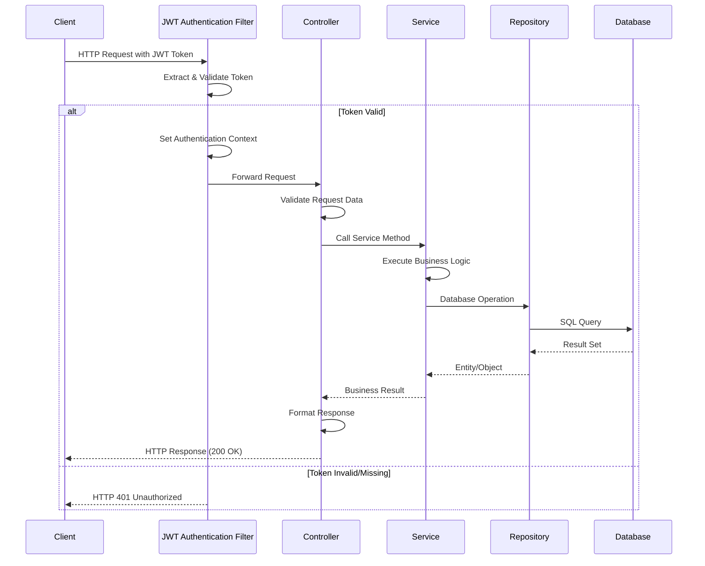
```mermaid
sequenceDiagram
    participant Client
    participant SecurityFilter as JWT Authentication Filter
    participant Controller
    participant Service
    participant Repository
    participant Database

    Client->>SecurityFilter: HTTP Request with JWT Token
    SecurityFilter->>SecurityFilter: Extract & Validate Token
    alt Token Valid
        SecurityFilter->>SecurityFilter: Set Authentication Context
        SecurityFilter->>Controller: Forward Request
        Controller->>Controller: Validate Request Data
        Controller->>Service: Call Service Method
        Service->>Service: Execute Business Logic
        Service->>Repository: Database Operation
        Repository->>Database: SQL Query
        Database-->>Repository: Result Set
        Repository-->>Service: Entity/Object
        Service-->>Controller: Business Result
        Controller->>Controller: Format Response
        Controller-->>Client: HTTP Response (200 OK)
    else Token Invalid/Missing
        SecurityFilter-->>Client: HTTP 401 Unauthorized
    end
```

### Request Flow Through Layers

```
HTTP Request
    ↓
[Security Filter Chain]
    ├─ CORS Filter
    ├─ JWT Authentication Filter
    └─ Security Context Setup
    ↓
[Controller Layer]
    ├─ Request Validation (@Valid)
    ├─ Path Variable Extraction
    ├─ Request Body Parsing
    └─ Principal Extraction (authenticated user)
    ↓
[Service Layer]
    ├─ Business Logic Execution
    ├─ Transaction Management (@Transactional)
    ├─ Entity Validation
    └─ External Service Calls
    ↓
[Repository Layer]
    ├─ JPA Query Execution
    ├─ Entity Mapping
    └─ Database Interaction
    ↓
[Database - TiDB]
    ├─ SQL Execution
    └─ Data Retrieval/Modification
    ↓
Response flows back through layers
    ↓
HTTP Response
```

---

## Authentication Flow

### JWT Token Generation and Validation

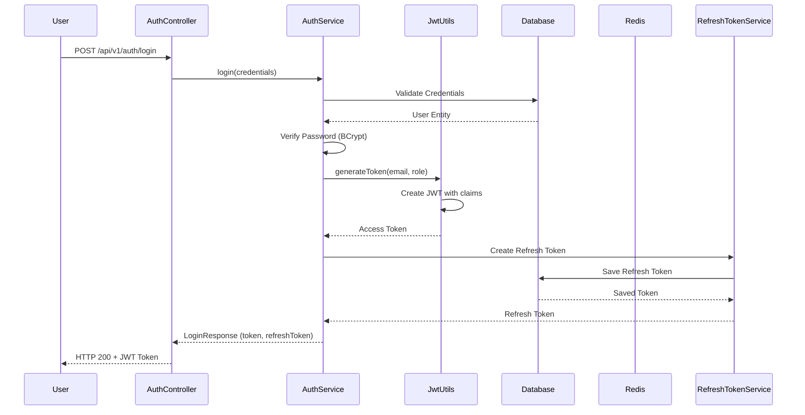
```mermaid
sequenceDiagram
    participant User
    participant AuthController
    participant AuthService
    participant JwtUtils
    participant Database
    participant Redis

    User->>AuthController: POST /api/v1/auth/login
    AuthController->>AuthService: login(credentials)
    AuthService->>Database: Validate Credentials
    Database-->>AuthService: User Entity
    AuthService->>AuthService: Verify Password (BCrypt)
    AuthService->>JwtUtils: generateToken(email, role)
    JwtUtils->>JwtUtils: Create JWT with claims
    JwtUtils-->>AuthService: Access Token
    AuthService->>RefreshTokenService: Create Refresh Token
    RefreshTokenService->>Database: Save Refresh Token
    Database-->>RefreshTokenService: Saved Token
    RefreshTokenService-->>AuthService: Refresh Token
    AuthService-->>AuthController: LoginResponse (token, refreshToken)
    AuthController-->>User: HTTP 200 + JWT Token
```

### JWT Token Structure

```
Header:
{
  "alg": "HS256",
  "typ": "JWT"
}

Payload:
{
  "sub": "user@example.com",      // Subject (email)
  "role": "ROLE_CUSTOMER",         // User role
  "iat": 1234567890,              // Issued at
  "exp": 1234654290                // Expiration (24 hours)
}

Signature:
HMACSHA256(
  base64UrlEncode(header) + "." + base64UrlEncode(payload),
  secret
)
```

### Token Validation in Request

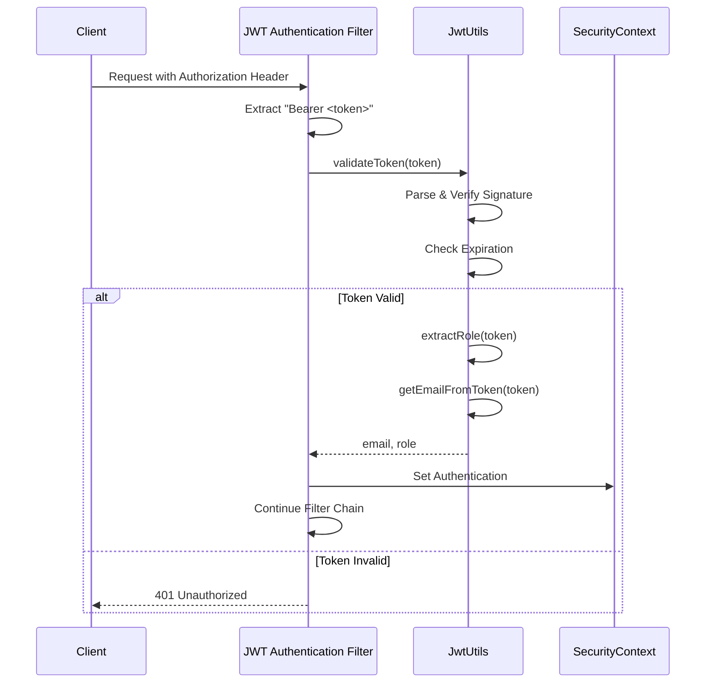
```mermaid
sequenceDiagram
    participant Client
    participant JwtFilter as JWT Authentication Filter
    participant JwtUtils
    participant SecurityContext

    Client->>JwtFilter: Request with Authorization Header
    JwtFilter->>JwtFilter: Extract "Bearer <token>"
    JwtFilter->>JwtUtils: validateToken(token)
    JwtUtils->>JwtUtils: Parse & Verify Signature
    JwtUtils->>JwtUtils: Check Expiration
    alt Token Valid
        JwtUtils->>JwtUtils: extractRole(token)
        JwtUtils->>JwtUtils: getEmailFromToken(token)
        JwtUtils-->>JwtFilter: email, role
        JwtFilter->>SecurityContext: Set Authentication
        JwtFilter->>JwtFilter: Continue Filter Chain
    else Token Invalid
        JwtFilter-->>Client: 401 Unauthorized
    end
```

---

## Customer Registration Flow

### Complete Customer Registration Process

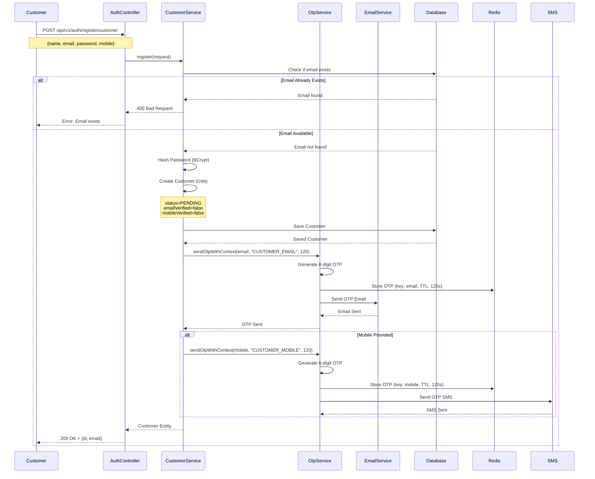
```mermaid
sequenceDiagram
    participant Customer
    participant AuthController
    participant CustomerService
    participant OtpService
    participant EmailService
    participant Database
    participant Redis

    Customer->>AuthController: POST /api/v1/auth/register/customer
    Note over Customer,AuthController: {name, email, password, mobile}
    AuthController->>CustomerService: register(request)
    CustomerService->>Database: Check if email exists
    alt Email Already Exists
        Database-->>CustomerService: Email found
        CustomerService-->>AuthController: 400 Bad Request
        AuthController-->>Customer: Error: Email exists
    else Email Available
        Database-->>CustomerService: Email not found
        CustomerService->>CustomerService: Hash Password (BCrypt)
        CustomerService->>CustomerService: Create Customer Entity
        Note over CustomerService: status=PENDING<br/>emailVerified=false<br/>mobileVerified=false
        CustomerService->>Database: Save Customer
        Database-->>CustomerService: Saved Customer
        CustomerService->>OtpService: sendOtpWithContext(email, "CUSTOMER_EMAIL", 120)
        OtpService->>OtpService: Generate 6-digit OTP
        OtpService->>Redis: Store OTP (key: email, TTL: 120s)
        OtpService->>EmailService: Send OTP Email
        EmailService-->>OtpService: Email Sent
        OtpService-->>CustomerService: OTP Sent
        alt Mobile Provided
            CustomerService->>OtpService: sendOtpWithContext(mobile, "CUSTOMER_MOBILE", 120)
            OtpService->>OtpService: Generate 6-digit OTP
            OtpService->>Redis: Store OTP (key: mobile, TTL: 120s)
            OtpService->>SMS: Send OTP SMS
            SMS-->>OtpService: SMS Sent
        end
        CustomerService-->>AuthController: Customer Entity
        AuthController-->>Customer: 200 OK + {id, email}
    end
```

### Customer Email Verification Flow

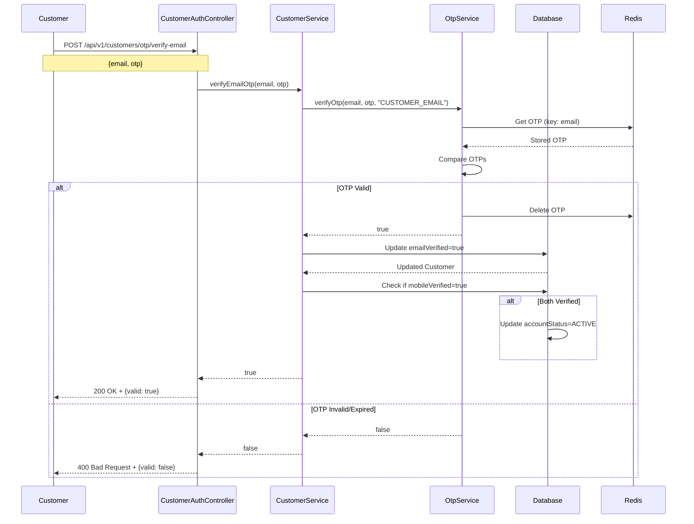
```mermaid
sequenceDiagram
    participant Customer
    participant CustomerAuthController
    participant CustomerService
    participant OtpService
    participant Database
    participant Redis

    Customer->>CustomerAuthController: POST /api/v1/customers/otp/verify-email
    Note over Customer,CustomerAuthController: {email, otp}
    CustomerAuthController->>CustomerService: verifyEmailOtp(email, otp)
    CustomerService->>OtpService: verifyOtp(email, otp, "CUSTOMER_EMAIL")
    OtpService->>Redis: Get OTP (key: email)
    Redis-->>OtpService: Stored OTP
    OtpService->>OtpService: Compare OTPs
    alt OTP Valid
        OtpService->>Redis: Delete OTP
        OtpService-->>CustomerService: true
        CustomerService->>Database: Update emailVerified=true
        Database-->>CustomerService: Updated Customer
        CustomerService->>Database: Check if mobileVerified=true
        alt Both Verified
            Database->>Database: Update accountStatus=ACTIVE
        end
        CustomerService-->>CustomerAuthController: true
        CustomerAuthController-->>Customer: 200 OK + {valid: true}
    else OTP Invalid/Expired
        OtpService-->>CustomerService: false
        CustomerService-->>CustomerAuthController: false
        CustomerAuthController-->>Customer: 400 Bad Request + {valid: false}
    end
```

---

## Seller Registration Flow

### Seller Registration and Verification

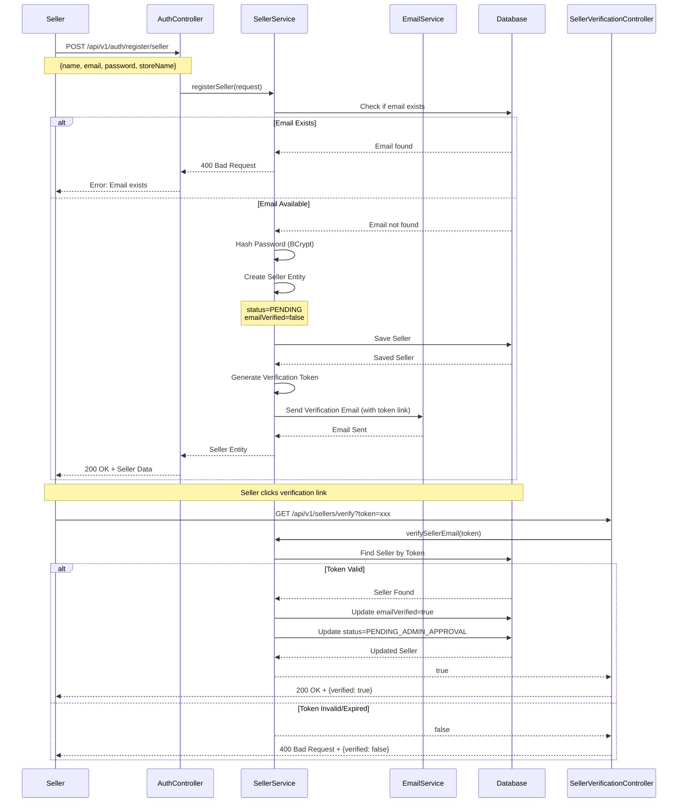
```mermaid
sequenceDiagram
    participant Seller
    participant AuthController
    participant SellerService
    participant EmailService
    participant Database

    Seller->>AuthController: POST /api/v1/auth/register/seller
    Note over Seller,AuthController: {name, email, password, storeName}
    AuthController->>SellerService: registerSeller(request)
    SellerService->>Database: Check if email exists
    alt Email Exists
        Database-->>SellerService: Email found
        SellerService-->>AuthController: 400 Bad Request
        AuthController-->>Seller: Error: Email exists
    else Email Available
        Database-->>SellerService: Email not found
        SellerService->>SellerService: Hash Password (BCrypt)
        SellerService->>SellerService: Create Seller Entity
        Note over SellerService: status=PENDING<br/>emailVerified=false
        SellerService->>Database: Save Seller
        Database-->>SellerService: Saved Seller
        SellerService->>SellerService: Generate Verification Token
        SellerService->>EmailService: Send Verification Email (with token link)
        EmailService-->>SellerService: Email Sent
        SellerService-->>AuthController: Seller Entity
        AuthController-->>Seller: 200 OK + Seller Data
    end

    Note over Seller,Database: Seller clicks verification link
    Seller->>SellerVerificationController: GET /api/v1/sellers/verify?token=xxx
    SellerVerificationController->>SellerService: verifySellerEmail(token)
    SellerService->>Database: Find Seller by Token
    alt Token Valid
        Database-->>SellerService: Seller Found
        SellerService->>Database: Update emailVerified=true
        SellerService->>Database: Update status=PENDING_ADMIN_APPROVAL
        Database-->>SellerService: Updated Seller
        SellerService-->>SellerVerificationController: true
        SellerVerificationController-->>Seller: 200 OK + {verified: true}
    else Token Invalid/Expired
        SellerService-->>SellerVerificationController: false
        SellerVerificationController-->>Seller: 400 Bad Request + {verified: false}
    end
```

---

## Login Flow

### Customer Login Process

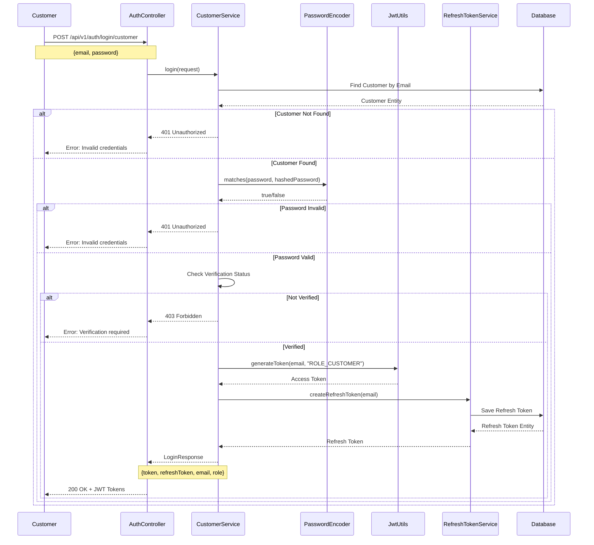
```mermaid
sequenceDiagram
    participant Customer
    participant AuthController
    participant CustomerService
    participant PasswordEncoder
    participant JwtUtils
    participant RefreshTokenService
    participant Database

    Customer->>AuthController: POST /api/v1/auth/login/customer
    Note over Customer,AuthController: {email, password}
    AuthController->>CustomerService: login(request)
    CustomerService->>Database: Find Customer by Email
    Database-->>CustomerService: Customer Entity
    alt Customer Not Found
        CustomerService-->>AuthController: 401 Unauthorized
        AuthController-->>Customer: Error: Invalid credentials
    else Customer Found
        CustomerService->>PasswordEncoder: matches(password, hashedPassword)
        PasswordEncoder-->>CustomerService: true/false
        alt Password Invalid
            CustomerService-->>AuthController: 401 Unauthorized
            AuthController-->>Customer: Error: Invalid credentials
        else Password Valid
            CustomerService->>CustomerService: Check Verification Status
            alt Not Verified
                CustomerService-->>AuthController: 403 Forbidden
                AuthController-->>Customer: Error: Verification required
            else Verified
                CustomerService->>JwtUtils: generateToken(email, "ROLE_CUSTOMER")
                JwtUtils-->>CustomerService: Access Token
                CustomerService->>RefreshTokenService: createRefreshToken(email)
                RefreshTokenService->>Database: Save Refresh Token
                Database-->>RefreshTokenService: Refresh Token Entity
                RefreshTokenService-->>CustomerService: Refresh Token
                CustomerService-->>AuthController: LoginResponse
                Note over CustomerService,AuthController: {token, refreshToken, email, role}
                AuthController-->>Customer: 200 OK + JWT Tokens
            end
        end
    end
```

### Token Refresh Flow

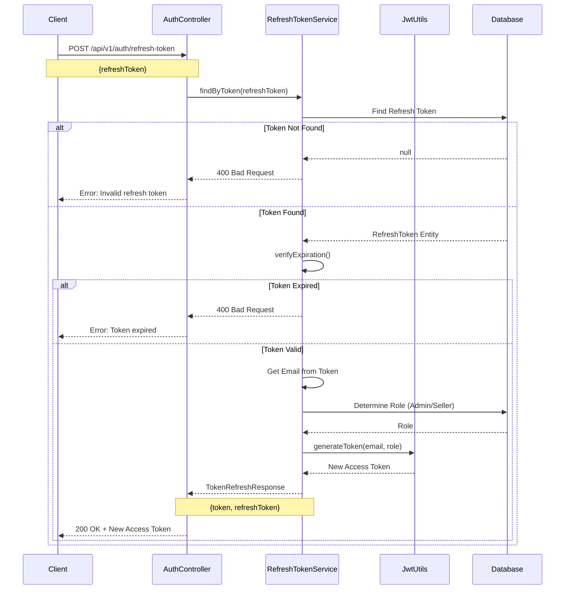
```mermaid
sequenceDiagram
    participant Client
    participant AuthController
    participant RefreshTokenService
    participant JwtUtils
    participant Database

    Client->>AuthController: POST /api/v1/auth/refresh-token
    Note over Client,AuthController: {refreshToken}
    AuthController->>RefreshTokenService: findByToken(refreshToken)
    RefreshTokenService->>Database: Find Refresh Token
    alt Token Not Found
        Database-->>RefreshTokenService: null
        RefreshTokenService-->>AuthController: 400 Bad Request
        AuthController-->>Client: Error: Invalid refresh token
    else Token Found
        Database-->>RefreshTokenService: RefreshToken Entity
        RefreshTokenService->>RefreshTokenService: verifyExpiration()
        alt Token Expired
            RefreshTokenService-->>AuthController: 400 Bad Request
            AuthController-->>Client: Error: Token expired
        else Token Valid
            RefreshTokenService->>RefreshTokenService: Get Email from Token
            RefreshTokenService->>Database: Determine Role (Admin/Seller)
            Database-->>RefreshTokenService: Role
            RefreshTokenService->>JwtUtils: generateToken(email, role)
            JwtUtils-->>RefreshTokenService: New Access Token
            RefreshTokenService-->>AuthController: TokenRefreshResponse
            Note over RefreshTokenService,AuthController: {token, refreshToken}
            AuthController-->>Client: 200 OK + New Access Token
        end
    end
```

---

## Order Processing Flow

### Checkout and Order Creation

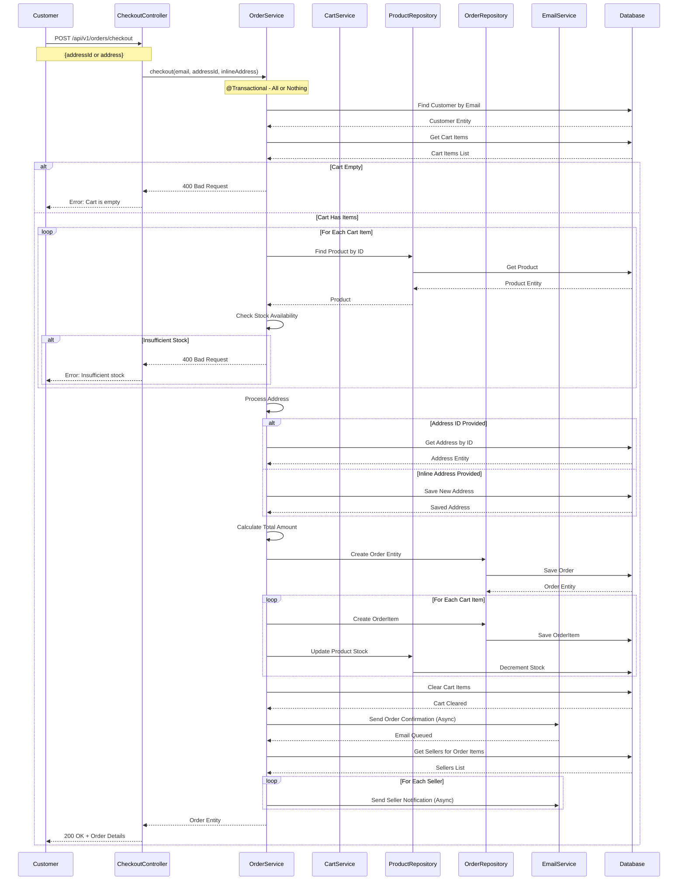
```mermaid
sequenceDiagram
    participant Customer
    participant CheckoutController
    participant OrderService
    participant CartService
    participant ProductRepository
    participant OrderRepository
    participant EmailService
    participant Database

    Customer->>CheckoutController: POST /api/v1/orders/checkout
    Note over Customer,CheckoutController: {addressId or address}
    CheckoutController->>OrderService: checkout(email, addressId, inlineAddress)
    
    Note over OrderService: @Transactional - All or Nothing
    
    OrderService->>Database: Find Customer by Email
    Database-->>OrderService: Customer Entity
    OrderService->>Database: Get Cart Items
    Database-->>OrderService: Cart Items List
    
    alt Cart Empty
        OrderService-->>CheckoutController: 400 Bad Request
        CheckoutController-->>Customer: Error: Cart is empty
    else Cart Has Items
        loop For Each Cart Item
            OrderService->>ProductRepository: Find Product by ID
            ProductRepository->>Database: Get Product
            Database-->>ProductRepository: Product Entity
            ProductRepository-->>OrderService: Product
            OrderService->>OrderService: Check Stock Availability
            alt Insufficient Stock
                OrderService-->>CheckoutController: 400 Bad Request
                CheckoutController-->>Customer: Error: Insufficient stock
            end
        end
        
        OrderService->>OrderService: Process Address
        alt Address ID Provided
            OrderService->>Database: Get Address by ID
            Database-->>OrderService: Address Entity
        else Inline Address Provided
            OrderService->>Database: Save New Address
            Database-->>OrderService: Saved Address
        end
        
        OrderService->>OrderService: Calculate Total Amount
        OrderService->>OrderRepository: Create Order Entity
        OrderRepository->>Database: Save Order
        Database-->>OrderRepository: Order Entity
        
        loop For Each Cart Item
            OrderService->>OrderRepository: Create OrderItem
            OrderRepository->>Database: Save OrderItem
            OrderService->>ProductRepository: Update Product Stock
            ProductRepository->>Database: Decrement Stock
        end
        
        OrderService->>Database: Clear Cart Items
        Database-->>OrderService: Cart Cleared
        
        OrderService->>EmailService: Send Order Confirmation (Async)
        EmailService-->>OrderService: Email Queued
        
        OrderService->>Database: Get Sellers for Order Items
        Database-->>OrderService: Sellers List
        loop For Each Seller
            OrderService->>EmailService: Send Seller Notification (Async)
        end
        
        OrderService-->>CheckoutController: Order Entity
        CheckoutController-->>Customer: 200 OK + Order Details
    end
```

### Order Status Update Flow (Seller)

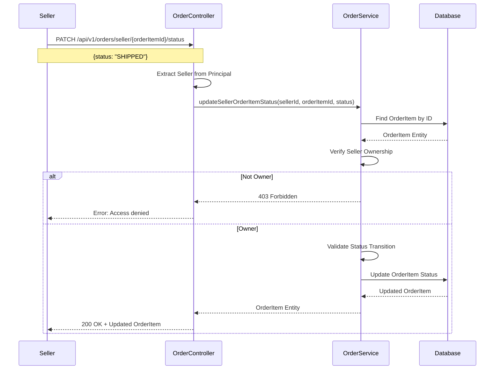
```mermaid
sequenceDiagram
    participant Seller
    participant OrderController
    participant OrderService
    participant Database

    Seller->>OrderController: PATCH /api/v1/orders/seller/{orderItemId}/status
    Note over Seller,OrderController: {status: "SHIPPED"}
    OrderController->>OrderController: Extract Seller from Principal
    OrderController->>OrderService: updateSellerOrderItemStatus(sellerId, orderItemId, status)
    OrderService->>Database: Find OrderItem by ID
    Database-->>OrderService: OrderItem Entity
    OrderService->>OrderService: Verify Seller Ownership
    alt Not Owner
        OrderService-->>OrderController: 403 Forbidden
        OrderController-->>Seller: Error: Access denied
    else Owner
        OrderService->>OrderService: Validate Status Transition
        OrderService->>Database: Update OrderItem Status
        Database-->>OrderService: Updated OrderItem
        OrderService-->>OrderController: OrderItem Entity
        OrderController-->>Seller: 200 OK + Updated OrderItem
    end
```

---

## Product Management Flow

### Add Product Flow (Seller)

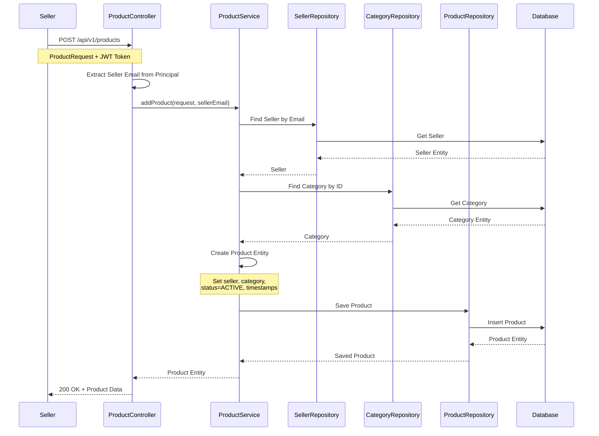
```mermaid
sequenceDiagram
    participant Seller
    participant ProductController
    participant ProductService
    participant SellerRepository
    participant CategoryRepository
    participant ProductRepository
    participant Database

    Seller->>ProductController: POST /api/v1/products
    Note over Seller,ProductController: ProductRequest + JWT Token
    ProductController->>ProductController: Extract Seller Email from Principal
    ProductController->>ProductService: addProduct(request, sellerEmail)
    ProductService->>SellerRepository: Find Seller by Email
    SellerRepository->>Database: Get Seller
    Database-->>SellerRepository: Seller Entity
    SellerRepository-->>ProductService: Seller
    ProductService->>CategoryRepository: Find Category by ID
    CategoryRepository->>Database: Get Category
    Database-->>CategoryRepository: Category Entity
    CategoryRepository-->>ProductService: Category
    ProductService->>ProductService: Create Product Entity
    Note over ProductService: Set seller, category,<br/>status=ACTIVE, timestamps
    ProductService->>ProductRepository: Save Product
    ProductRepository->>Database: Insert Product
    Database-->>ProductRepository: Product Entity
    ProductRepository-->>ProductService: Saved Product
    ProductService-->>ProductController: Product Entity
    ProductController-->>Seller: 200 OK + Product Data
```

### Product Status Update Flow

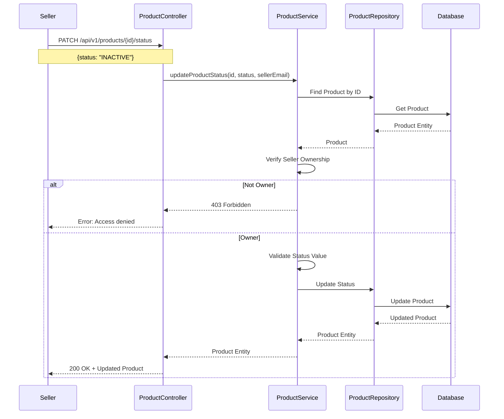
```mermaid
sequenceDiagram
    participant Seller
    participant ProductController
    participant ProductService
    participant ProductRepository
    participant Database

    Seller->>ProductController: PATCH /api/v1/products/{id}/status
    Note over Seller,ProductController: {status: "INACTIVE"}
    ProductController->>ProductService: updateProductStatus(id, status, sellerEmail)
    ProductService->>ProductRepository: Find Product by ID
    ProductRepository->>Database: Get Product
    Database-->>ProductRepository: Product Entity
    ProductRepository-->>ProductService: Product
    ProductService->>ProductService: Verify Seller Ownership
    alt Not Owner
        ProductService-->>ProductController: 403 Forbidden
        ProductController-->>Seller: Error: Access denied
    else Owner
        ProductService->>ProductService: Validate Status Value
        ProductService->>ProductRepository: Update Status
        ProductRepository->>Database: Update Product
        Database-->>ProductRepository: Updated Product
        ProductRepository-->>ProductService: Product Entity
        ProductService-->>ProductController: Product Entity
        ProductController-->>Seller: 200 OK + Updated Product
    end
```

---

## Cart Management Flow

### Add/Update Cart Item

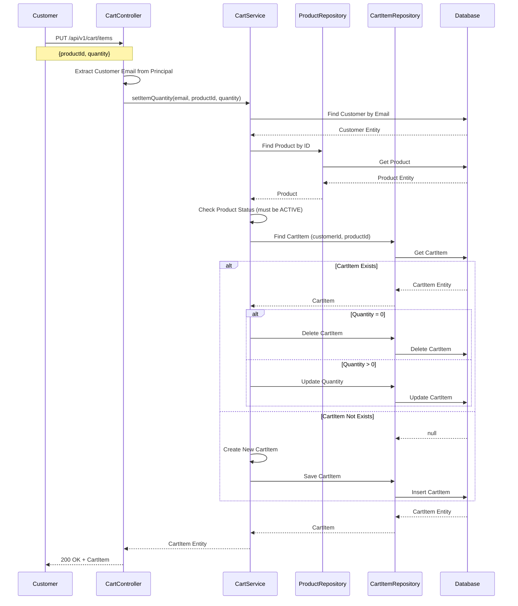
```mermaid
sequenceDiagram
    participant Customer
    participant CartController
    participant CartService
    participant ProductRepository
    participant CartItemRepository
    participant Database

    Customer->>CartController: PUT /api/v1/cart/items
    Note over Customer,CartController: {productId, quantity}
    CartController->>CartController: Extract Customer Email from Principal
    CartController->>CartService: setItemQuantity(email, productId, quantity)
    CartService->>Database: Find Customer by Email
    Database-->>CartService: Customer Entity
    CartService->>ProductRepository: Find Product by ID
    ProductRepository->>Database: Get Product
    Database-->>ProductRepository: Product Entity
    ProductRepository-->>CartService: Product
    CartService->>CartService: Check Product Status (must be ACTIVE)
    CartService->>CartItemRepository: Find CartItem (customerId, productId)
    CartItemRepository->>Database: Get CartItem
    alt CartItem Exists
        Database-->>CartItemRepository: CartItem Entity
        CartItemRepository-->>CartService: CartItem
        alt Quantity = 0
            CartService->>CartItemRepository: Delete CartItem
            CartItemRepository->>Database: Delete CartItem
        else Quantity > 0
            CartService->>CartItemRepository: Update Quantity
            CartItemRepository->>Database: Update CartItem
        end
    else CartItem Not Exists
        Database-->>CartItemRepository: null
        CartService->>CartService: Create New CartItem
        CartService->>CartItemRepository: Save CartItem
        CartItemRepository->>Database: Insert CartItem
    end
    Database-->>CartItemRepository: CartItem Entity
    CartItemRepository-->>CartService: CartItem
    CartService-->>CartController: CartItem Entity
    CartController-->>Customer: 200 OK + CartItem
```

### Get Cart with Products

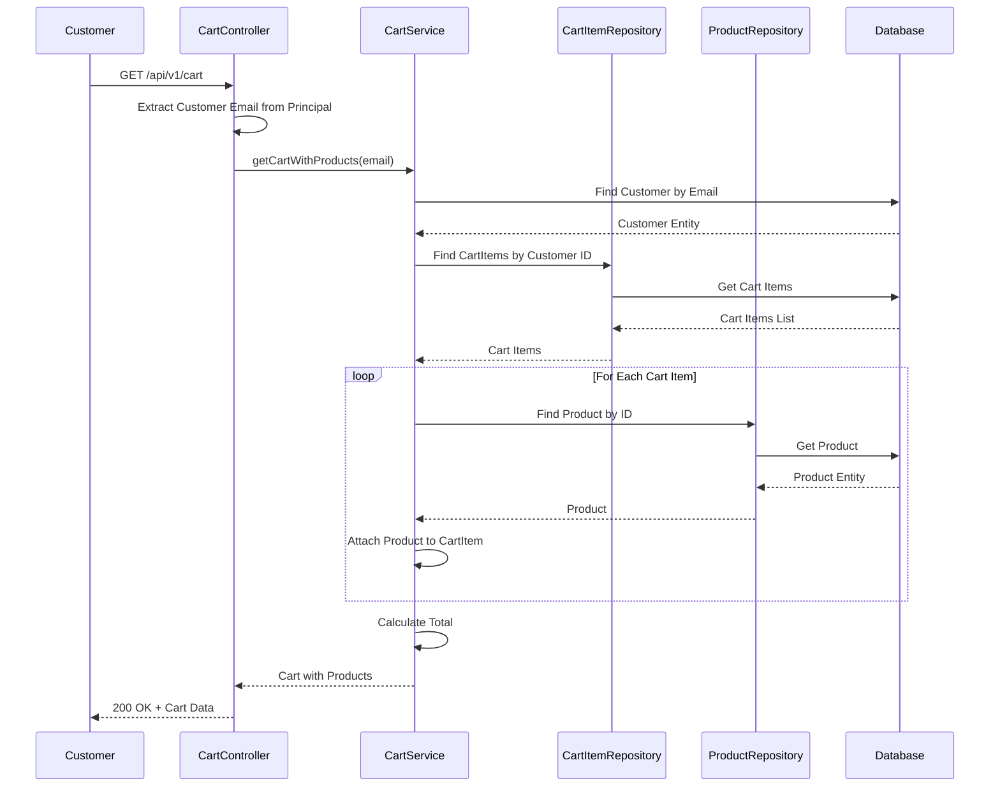
```mermaid
sequenceDiagram
    participant Customer
    participant CartController
    participant CartService
    participant CartItemRepository
    participant ProductRepository
    participant Database

    Customer->>CartController: GET /api/v1/cart
    CartController->>CartController: Extract Customer Email from Principal
    CartController->>CartService: getCartWithProducts(email)
    CartService->>Database: Find Customer by Email
    Database-->>CartService: Customer Entity
    CartService->>CartItemRepository: Find CartItems by Customer ID
    CartItemRepository->>Database: Get Cart Items
    Database-->>CartItemRepository: Cart Items List
    CartItemRepository-->>CartService: Cart Items
    loop For Each Cart Item
        CartService->>ProductRepository: Find Product by ID
        ProductRepository->>Database: Get Product
        Database-->>ProductRepository: Product Entity
        ProductRepository-->>CartService: Product
        CartService->>CartService: Attach Product to CartItem
    end
    CartService->>CartService: Calculate Total
    CartService-->>CartController: Cart with Products
    CartController-->>Customer: 200 OK + Cart Data
```

---

## OTP Verification Flow

### OTP Generation and Storage

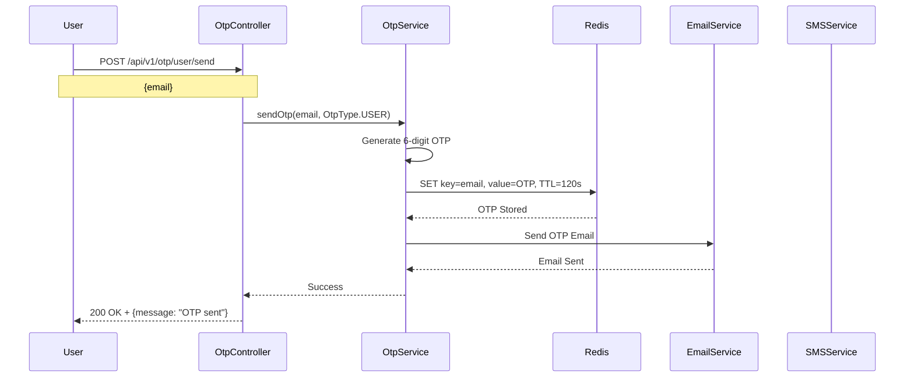
```mermaid
sequenceDiagram
    participant User
    participant OtpController
    participant OtpService
    participant Redis
    participant EmailService
    participant SMSService

    User->>OtpController: POST /api/v1/otp/user/send
    Note over User,OtpController: {email}
    OtpController->>OtpService: sendOtp(email, OtpType.USER)
    OtpService->>OtpService: Generate 6-digit OTP
    OtpService->>Redis: SET key=email, value=OTP, TTL=120s
    Redis-->>OtpService: OTP Stored
    OtpService->>EmailService: Send OTP Email
    EmailService-->>OtpService: Email Sent
    OtpService-->>OtpController: Success
    OtpController-->>User: 200 OK + {message: "OTP sent"}
```

### OTP Verification

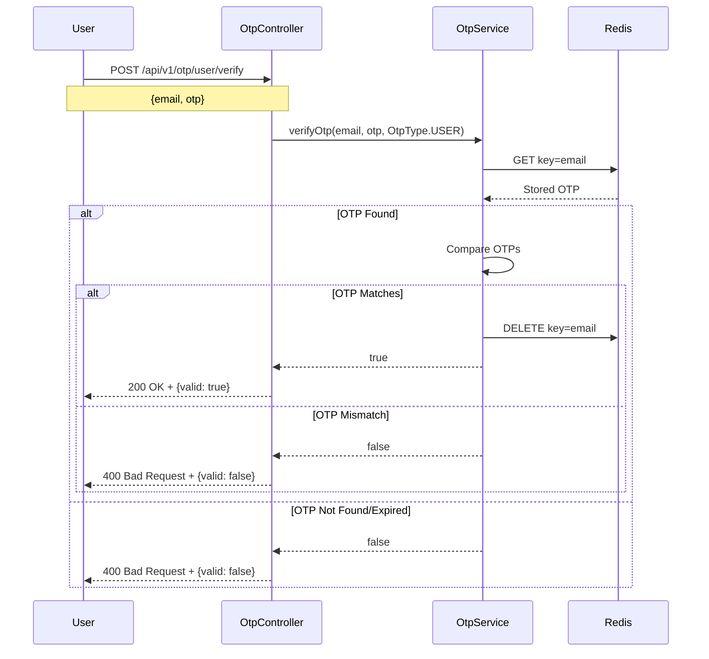
```mermaid
sequenceDiagram
    participant User
    participant OtpController
    participant OtpService
    participant Redis

    User->>OtpController: POST /api/v1/otp/user/verify
    Note over User,OtpController: {email, otp}
    OtpController->>OtpService: verifyOtp(email, otp, OtpType.USER)
    OtpService->>Redis: GET key=email
    Redis-->>OtpService: Stored OTP
    alt OTP Found
        OtpService->>OtpService: Compare OTPs
        alt OTP Matches
            OtpService->>Redis: DELETE key=email
            OtpService-->>OtpController: true
            OtpController-->>User: 200 OK + {valid: true}
        else OTP Mismatch
            OtpService-->>OtpController: false
            OtpController-->>User: 400 Bad Request + {valid: false}
        end
    else OTP Not Found/Expired
        OtpService-->>OtpController: false
        OtpController-->>User: 400 Bad Request + {valid: false}
    end
```

---

## Service Layer Interactions

### Complex Service Orchestration (Checkout Example)

```
OrderService.checkout()
    ├─ CustomerRepository.findByEmail()
    ├─ CartItemRepository.findByCustomerId()
    ├─ ProductRepository.findById() [multiple]
    ├─ CustomerAddressRepository.findById() or save()
    ├─ OrderRepository.save()
    ├─ OrderItemRepository.save() [multiple]
    ├─ ProductRepository.save() [update stock, multiple]
    ├─ CartItemRepository.delete() [clear cart]
    └─ EmailService.sendOrderConfirmation() [async]
        └─ EmailService.sendSellerNotification() [async, multiple]
```

### Transaction Management

All operations in `OrderService.checkout()` are wrapped in `@Transactional`:

- **If all succeed**: Transaction commits, all changes saved
- **If any fails**: Transaction rolls back, all changes reverted
- **Ensures**: Data consistency (no partial orders, no stock inconsistencies)

---

## Error Handling Flow

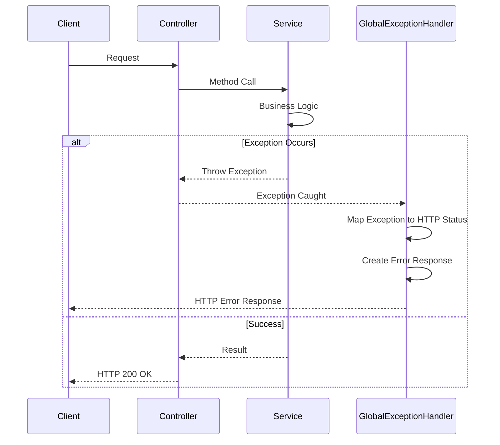
```mermaid
sequenceDiagram
    participant Client
    participant Controller
    participant Service
    participant GlobalExceptionHandler
    participant Client

    Client->>Controller: Request
    Controller->>Service: Method Call
    Service->>Service: Business Logic
    alt Exception Occurs
        Service-->>Controller: Throw Exception
        Controller-->>GlobalExceptionHandler: Exception Caught
        GlobalExceptionHandler->>GlobalExceptionHandler: Map Exception to HTTP Status
        GlobalExceptionHandler->>GlobalExceptionHandler: Create Error Response
        GlobalExceptionHandler-->>Client: HTTP Error Response
    else Success
        Service-->>Controller: Result
        Controller-->>Client: HTTP 200 OK
    end
```

### Common Exception Mappings

- `ResourceNotFoundException` → 404 Not Found
- `IllegalArgumentException` → 400 Bad Request
- `IllegalStateException` → 400 Bad Request
- `BadCredentialsException` → 401 Unauthorized
- `VerificationRequiredException` → 403 Forbidden
- `InvalidRefreshTokenException` → 400 Bad Request

---

## Summary

The NexaShop backend follows a clear flow pattern:

1. **Request Entry**: HTTP request enters through Security Filter
2. **Authentication**: JWT token validated, user context set
3. **Controller**: Request validated, service method called
4. **Service**: Business logic executed, transactions managed
5. **Repository**: Database operations performed
6. **Response**: Result flows back through layers
7. **Error Handling**: Exceptions caught and formatted appropriately

All critical operations (like checkout) use `@Transactional` to ensure data consistency and atomicity.
