# NexaShop Frontend Flow Documentation

This document describes the component flows, API request flows, state management flows, and user interaction flows in the NexaShop React frontend application.

---

## Table of Contents

1. [Component Rendering Flow](#component-rendering-flow)
2. [Authentication Flow](#authentication-flow)
3. [API Request Flow](#api-request-flow)
4. [Token Refresh Flow](#token-refresh-flow)
5. [Cart Management Flow](#cart-management-flow)
6. [Product Browsing Flow](#product-browsing-flow)
7. [Checkout Flow](#checkout-flow)
8. [State Update Flow](#state-update-flow)
9. [Route Navigation Flow](#route-navigation-flow)

---

## Component Rendering Flow

### React Component Lifecycle

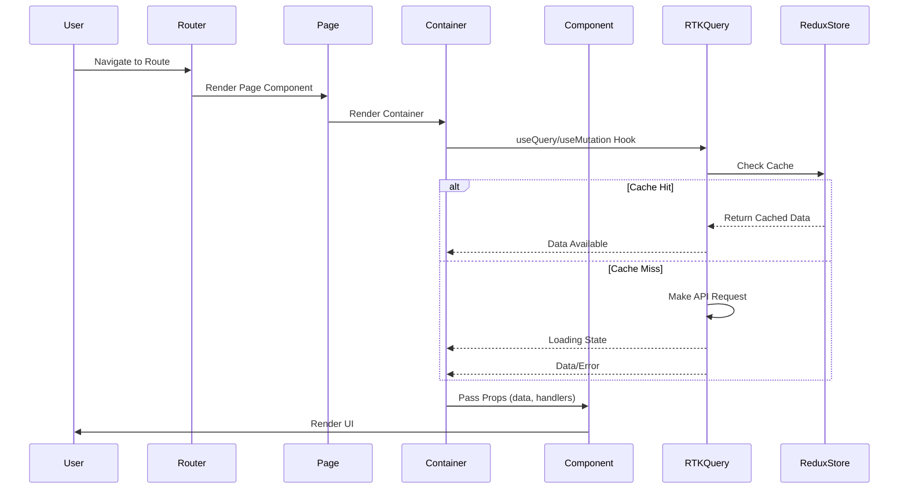

### Component Hierarchy Rendering

```
User Action / Route Change
    ↓
React Router
    ↓
Page Component (Route Entry)
    ↓
Container Component
    ├─ RTK Query Hook (fetch data)
    ├─ Redux Selector (get state)
    ├─ Event Handlers (user actions)
    └─ State Management
    ↓
Presentational Component
    ├─ Receives Props
    ├─ Renders UI
    └─ Calls Callbacks
    ↓
User Sees UI
```

---

## Authentication Flow

### Login Flow

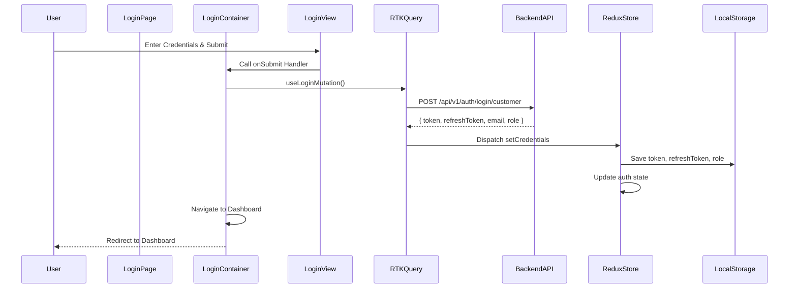

### Token Storage and Retrieval

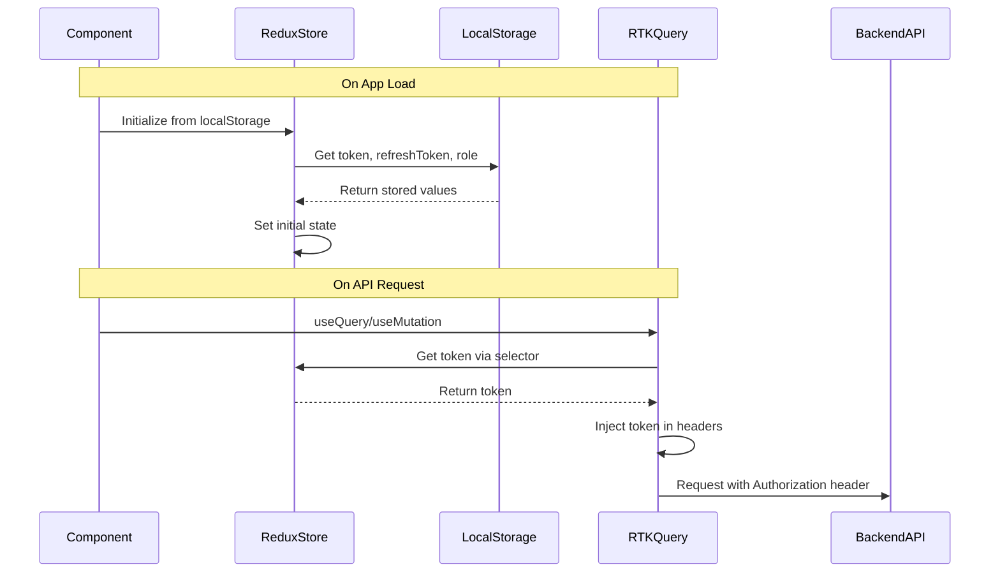

### Logout Flow

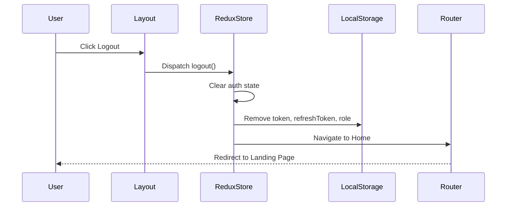

---

## API Request Flow

### RTK Query Request Flow

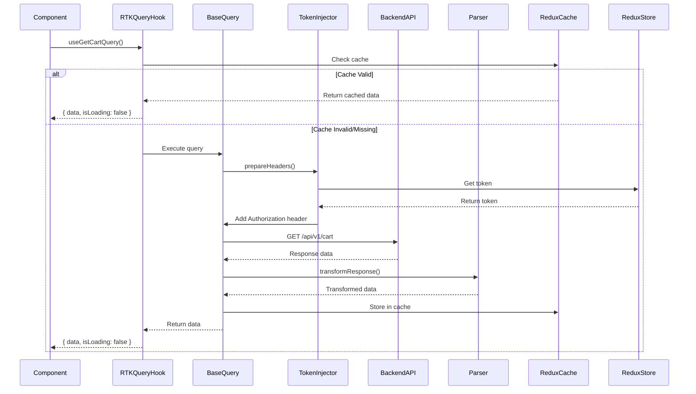

### Mutation Flow

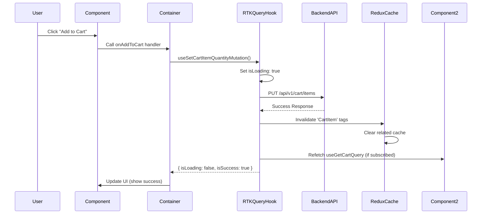

---

## Token Refresh Flow

### Automatic Token Refresh on 401

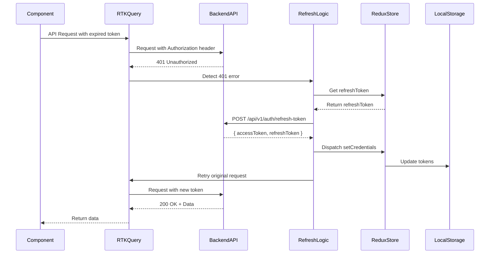

### Token Refresh Failure

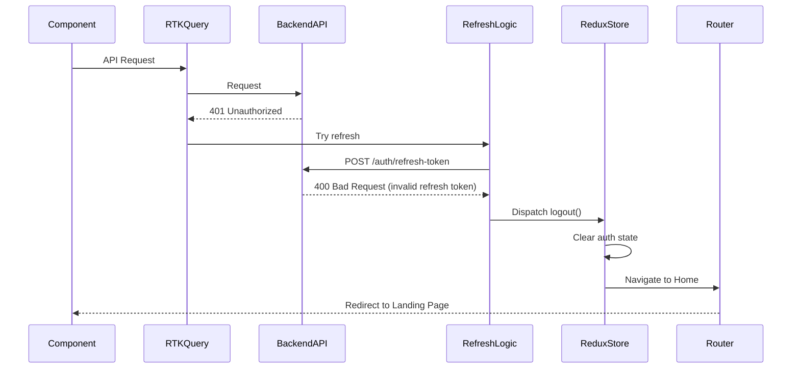

---

## Cart Management Flow

### Add to Cart Flow

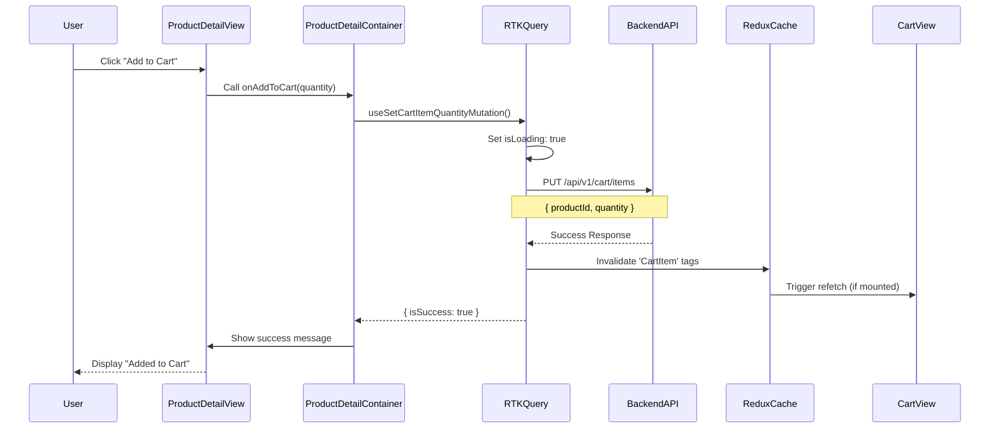

### Update Cart Quantity Flow

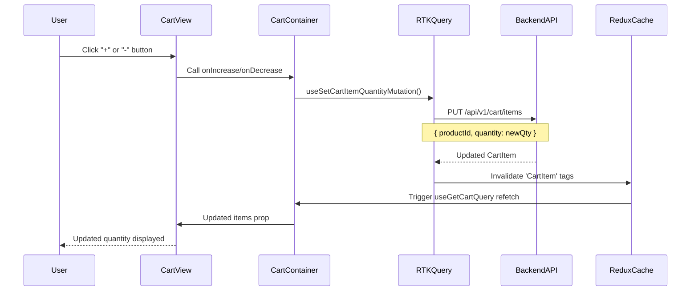

### Remove from Cart Flow

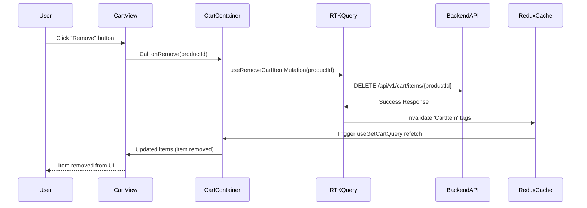

---

## Product Browsing Flow

### Product List Flow

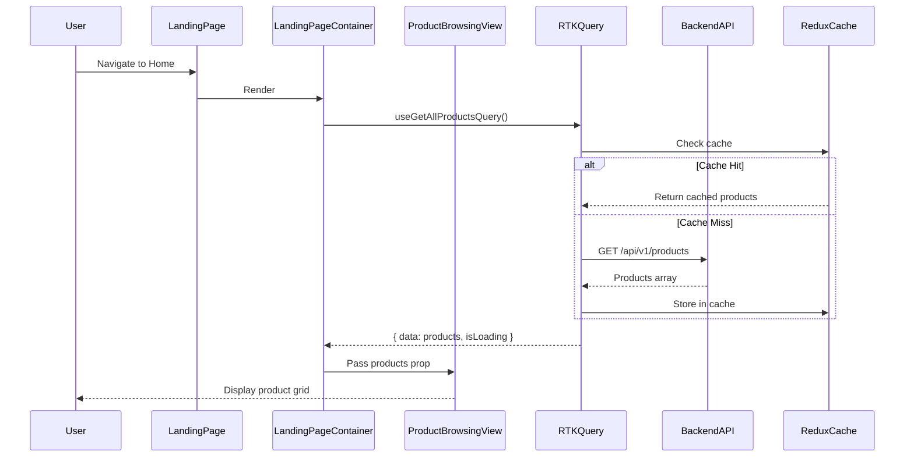

### Product Filter Flow

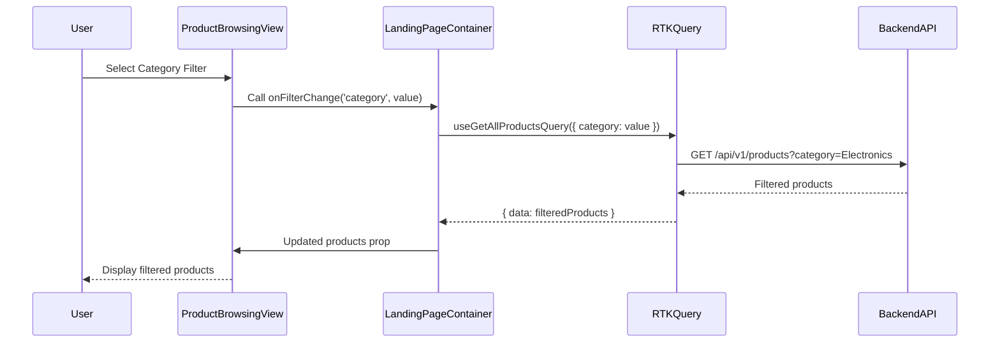

### Product Detail Flow

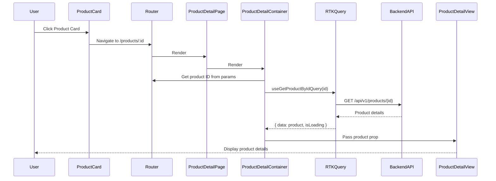

---

## Checkout Flow

### Complete Checkout Process

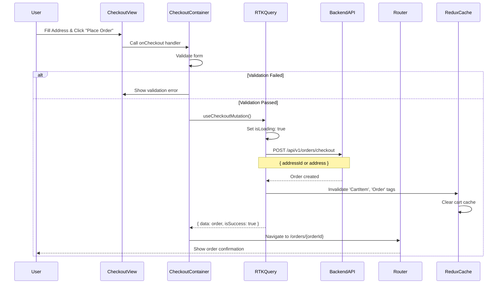

### Address Selection Flow

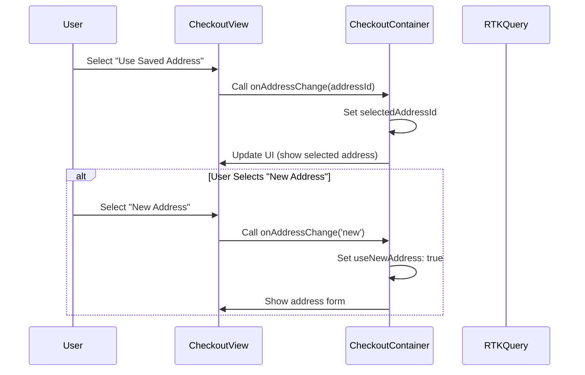

### Zip Code Lookup Flow

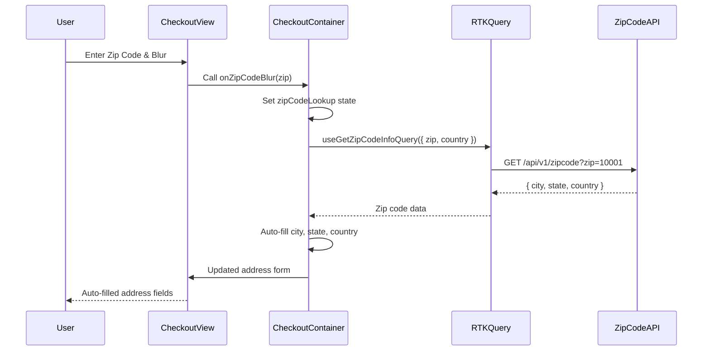

---

## State Update Flow

### Redux State Update

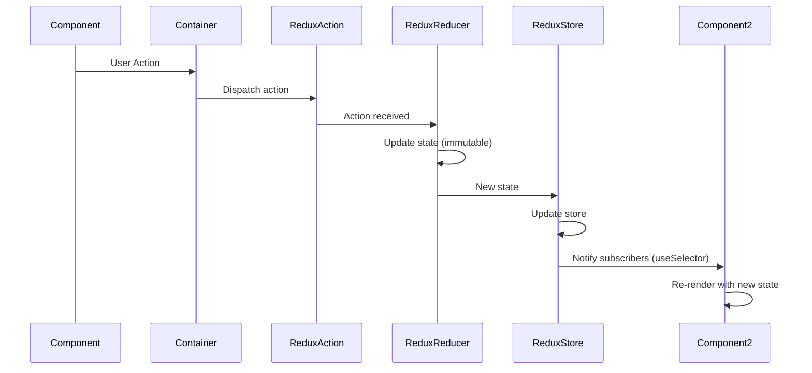

### RTK Query Cache Update

```mermaid
sequenceDiagram
    participant Component
    participant Mutation
    participant BackendAPI
    participant RTKQuery
    participant ReduxCache
    component Component2

    Component->>Mutation: useMutation().trigger()
    Mutation->>BackendAPI: API Request
    BackendAPI-->>Mutation: Success Response
    Mutation->>RTKQuery: invalidatesTags(['CartItem'])
    RTKQuery->>ReduxCache: Invalidate cache
    ReduxCache->>ReduxCache: Clear related cache entries
    ReduxCache->>Component2: Trigger refetch (if subscribed)
    Component2->>BackendAPI: Refetch query
    BackendAPI-->>Component2: Fresh data
    Component2-->>Component2: Update UI
```

---

## Route Navigation Flow

### Protected Route Flow

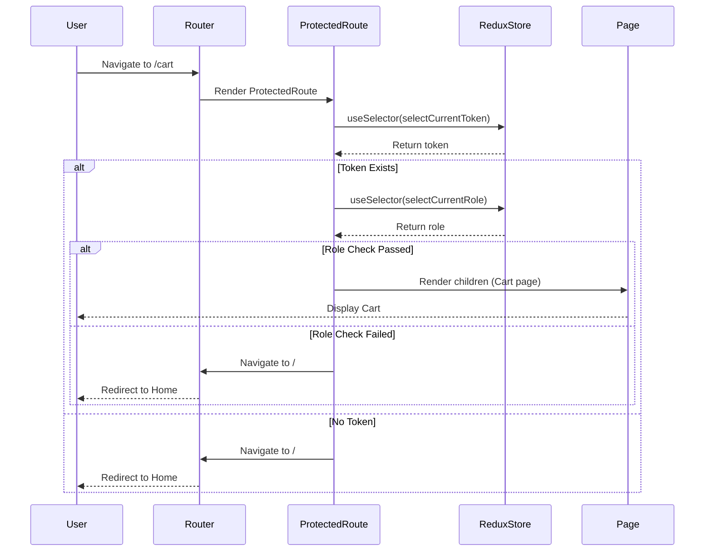

### Navigation After Login

```mermaid
sequenceDiagram
    participant User
    participant LoginContainer
    participant RTKQuery
    participant ReduxStore
    participant Router

    User->>LoginContainer: Submit Login Form
    LoginContainer->>RTKQuery: useLoginMutation()
    RTKQuery-->>LoginContainer: { isSuccess: true, data }
    LoginContainer->>ReduxStore: Dispatch setCredentials
    ReduxStore->>ReduxStore: Update auth state
    LoginContainer->>Router: Navigate based on role
    alt Role is 'customer'
        Router->>Router: Navigate to /cart or /
    else Role is 'seller'
        Router->>Router: Navigate to /seller/dashboard
    else Role is 'admin'
        Router->>Router: Navigate to /admin/dashboard
    end
    Router-->>User: Display appropriate dashboard
```

---

## Error Handling Flow

### API Error Handling

```mermaid
sequenceDiagram
    participant Component
    participant Container
    participant RTKQuery
    participant BackendAPI
    participant ErrorHandler

    Component->>Container: User Action
    Container->>RTKQuery: useMutation()
    RTKQuery->>BackendAPI: API Request
    BackendAPI-->>RTKQuery: Error Response (400/500)
    RTKQuery-->>Container: { error, isError: true }
    Container->>ErrorHandler: Handle error
    ErrorHandler->>ErrorHandler: Extract error message
    ErrorHandler->>Component: Show error (Toast/Alert)
    Component-->>User: Display error message
```

### Network Error Handling

```mermaid
sequenceDiagram
    participant Component
    participant RTKQuery
    participant Network
    participant ErrorHandler

    Component->>RTKQuery: API Request
    RTKQuery->>Network: Send request
    Network-->>RTKQuery: Network Error (timeout/offline)
    RTKQuery-->>Component: { error: 'Network Error', isError: true }
    Component->>ErrorHandler: Handle network error
    ErrorHandler->>Component: Show "Network Error" message
    Component-->>User: Display error notification
```

---

## Summary

The frontend flow follows these key patterns:

1. **Component Rendering**: Page → Container → Presentational
2. **API Requests**: RTK Query hooks with automatic caching
3. **State Management**: Redux for global state, local state for UI
4. **Authentication**: Token-based with automatic refresh
5. **Error Handling**: Centralized error handling in containers
6. **Navigation**: React Router with protected routes
7. **Cache Management**: Automatic cache invalidation on mutations

All flows are designed for optimal user experience, performance, and maintainability.
